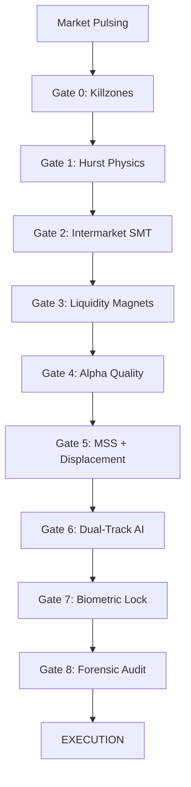

# Bayesian Pivot Trading Infra 🧠💎

**An institutional-grade synthetic consciousness for price discovery. The infrastructure replaces speculative liability with the certainty of a 9-Gate Bayesian funnel, orchestrating market physics (Hurst), intermarket confluence (SMT), and prop-firm forensic auditing. Leveraging specialized Vertex AI SFT models and biometric-gated OPSEC, the system enforces a high-fidelity probabilistic model of risk that transforms global liquidity volatility into a disciplined, sovereign advantage.**

Bayesian Pivot Trading Infra is a professional-grade trading OS that synthesizes Inner Circle Trader (ICT) concepts with high-frequency execution filters, multimodal trader sentiment analysis, and a tiered security architecture.

**"Bayesian institutional alpha. Replacing liability with 9-Gate probabilistic certainty: Vertex AI SFT, SMT, Hurst physics, biometrics, forensics & secure OPSEC."**

---

## 🛡️ The 9-Gate Signal Funnel (Deterministic Gauntlet)
No trade is executed in isolation. Every signal must survive a sequential "Gauntlet" to filter for institutional backing.

### Gate 0: Institutional Timing (Killzones)
Trading is restricted to high-liquidity windows where central bank algorithms are most active.
- **Asian Range**: 00:00 - 04:00 UTC (The "Anchor" for the day's expansion).
- **London Open**: 07:00 - 10:00 UTC (Search for the "Judas Swing").
- **NY Open**: 12:00 - 17:00 UTC (Final distribution or Reversal).

### Gate 1: Market Physics (Dual-Regime Hurst)
The system calculates a **200-candle rolling Hurst Exponent** to classify the market "State":
- **Efficiency (H < 0.45)**: Mean-Reverting. Activates *Reversal Mode* targeting liquidity sweeps.
- **Chaos (0.45 – 0.55)**: **SKIP**. No directional advantage detected.
- **Persistence (H > 0.55)**: Trending. Activates *Expansion Mode* targeting Fair Value Gaps.

### Gate 2: Intermarket Confluence (Vectorized SMT)
Real-time correlation audit between correlated assets (e.g., DXY/BTC/ETH).
- **SMT Divergence**: If the Dollar makes a Lower Low but the Asset fails to make a Higher High, institutional accumulation is confirmed.
- **Divergence Threshold**: Requires a >2.0 standard deviation separation to clear the gate.

### Gate 3: Liquidity Magnets (EQL/Sweep Pools)
Identification of high-conviction targets before entry.
- **EQL/EQH Mapping**: Detects "Retail Support/Resistance" as targets for institutional stop-clearing.
- **Order Flow Depth**: Scans for historical liquidity clusters where large orders are "hidden."

### Gate 4: HFT Alpha Precision (Wick Ratio Gating)
A mathematical filter for the quality of a liquidity sweep.
- **Cascade Depth**: Requires price to clear at least 2 levels of stop-liquidity before acknowledging a "Hunt."
- **Wick Quality**: Scores the rejection speed (>0.8 ATR) to ensure the move was a sweep, not a breakout.

### Gate 5: Structure Shift (MSS + Displacement)
Confirmation of intent shift on lower timeframes (1m-5m).
- **MSS**: A close beyond the most recent swing point.
- **Displacement**: Requires candles with bodies >1.5x the average volume/size to confirm a "V-shape" recovery or departure.

### Gate 6: Dual-Track AI Validation
Final logic audit via **Gemini 2.0 SFT Analysis** using a bifurcated review:
- **Control Track**: A "Reject-by-Default" persona analyzing the chart for retail inducement traps.
- **Shadow Track**: Experimental risk-adjustment (0.5x – 1.3x) based on setup-memory correlation.

### Gate 7: Biometric Physiological Lock
Biologically-aware execution gating via **Apple Health Integration**.
- **The Heart-Rate Gate**: If BPM > 100 or HRV < 25ms, the system detects "Trader Tilt" and restricts risk by 50-100%.
- **Physio-Gated Alpha**: Trading is only permitted when the practitioner is in a state of analytical coherence.

### Gate 8: Forensic Prop-Audit
Compliance auditing for institutional and funded account providers.
- **Loop Detection**: Scans for "Adversarial Loops" in rule documents (e.g., trailing equity drawdown).
- **Safety Margin**: Forces a hard stop if the session's projected risk exceeds firm-specific "Consistency Rule" thresholds.

---

## 🧠 The Sovereign Psychologist (Psychology Engine)
Trading is biological. This engine protects the system from the trader.
- **Multimodal Tilt Detection**: Analyzes user voice tone and chat sentiment to detect emotional distortion.
- **Risk Gating**: High Tilt (Score > 6) triggers automated trade-downsizing. Panic/Revenge indices trigger a **Hard Shutdown**.
- **Voice Verdicts**: The Gatekeeper provides auditory audits via macOS native TTS to ground the trader.

---

## 🧬 The Evolution Layer (SFT & Rogue Audit)
The system functions as a **Synthetic Consciousness** that learns from both its successes and the trader's failures.

### 1. Auto-Contextualization (Zero-Input Audit)
When a discretionary/manual trade is executed ("Rogue Trade"), the system immediately triggers a **Forensic Reconstruction**. Without human input, it fetches historical 5m/1h data to determine the full **Institutional Footprint** at the moment of entry:
- **HTF Bias Alignment**: Was the 4H/Daily trend (EMA 20/50) supportive of the move?
- **Liquidity Integrity**: Did the entry occur after a sweep of the Previous Day High/Low (PDH/PDL) or a key Swing point?
- **Intermarket SMT**: Were correlated assets (DXY/BTC) providing divergence confirmation?
- **Asian Volatility Window**: Price position relative to the Asian Range (Premium/Discount) and Session Timing.

### 2. Delta Analysis: System vs. Rogue
The infrastructure maintains two distinct ledgers:
- **System Signals**: 9-Gate approved setups with high probabilistic edge.
- **Rogue Trades**: Discretionary entries that bypassed the funnel.
The **Delta Engine** compares the outcomes of these two paths, identifying "Alpha Leakage" (where the trader was right but the system was too conservative) and "Impulse Traps" (where the trader was wrong and the system correctly rejected).

### 3. SFT Retraining Loop (Vertex AI)
Every Sunday at 00:00 UTC, the system executes an **Automated Retraining Cycle**:
- **Soft Training**: Updates the in-memory few-shot context window for Gemini with the past week's "Ground Truth" outcomes.
- **Hard Training**: Exports a JSONL dataset for deep **Supervised Fine-Tuning (SFT)** on Google Vertex AI. This ensures the 9-Gate math evolves to match shifting market regimes.

---

## 🔒 Security & Operations (OPSEC Layer)
The **Guard Engine** runs as a background daemon to protect the workstation:
- **RSA Provenance Chain**: Every signal is cryptographically signed using a local 2048-bit RSA key. This creates a tamper-evident audit trail for every trade, proving it originated from the system's logic and not a manual override.
- **Clipboard Sentry**: Detects crypto address hijacking.
- **Process Audit**: Whitelist-based process monitoring for process injection detection.
- **Zero-Trust Logic**: All credentials secured via `.env.local` with hardware-awake persistence.

---

## 📊 Prop Firm Compliance (The Auditor)
Built explicitly for funded accounts:
- **Drawdown Ceiling**: Hard risk management targeting <5% maximum drawdown.
- **Prop Guardian**: AI-powered forensic scraper for prop firm rule documents—detects trailing drawdown traps and consistency rules.
- **Automatic SL/TP**: ATR-weighted stops with multi-tier partial take-profit (TP1 @ 1.5R/2.0R, TP2 @ 3.0R/4.0R).

---

## 🚀 Execution & Backtesting
- **Vectorized Engine**: Backtest a full year of 1H data or 30 days of 5m data in seconds.
- **Institutional Realism**: Includes slippage (5bps), missed alert simulation, and commission-aware equity curves.
- **Hedge-Fund Stats**: Outputs Sharpe Ratio (6.35 achieved in Phase 5), Profit Factor, Expectancy, and Max Drawdown.

*Bayesian Pivot Trading Infra: Built for the 1% who trade with the 0.1%.*
