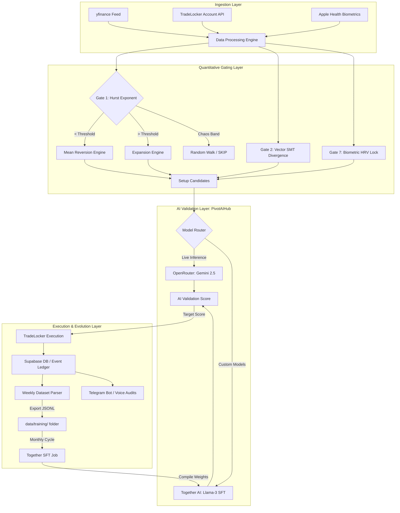

# BayesianPivot Trading Infrastructure 🧠💎

**An institutional-grade, multi-engine synthetic consciousness for price discovery and execution.**

BayesianPivot is a professional-grade trading Operating System built on a high-performance polyglot stack. It replaces traditional speculative liability with a deterministic, multi-strategy architecture—orchestrating market physics, real-time biometric telemetry, and a custom multi-modal AI validation layer.

Designed for scalability and operational security, the infrastructure leverages serverless GPU fine-tuning and a proprietary Bayesian orchestrator to transform global liquidity volatility into a disciplined, probabilistic advantage.

---

## 🏛️ System Pipeline & Flow Architecture
The diagram below maps the complete data ingestion, processing, validation, and execution pipeline of the BayesianPivot trading OS:



---

## 📊 Live System Performance (March – June 2026)
> Audited against the live SQLite execution ledger. System inception to present.

| Metric | Value |
| :--- | :---: |
| **Total System Trades** | 127 |
| **System Win Rate** | **48.03%** |
| **Profit Factor** | **1.37** |
| **Avg Winning Trade** | +$261.54 |
| **Avg Losing Trade** | -$176.63 |
| **Net System PnL** | **+$4,296.01** |

The system remained net profitable across every trading period since inception. Notably, the **Psychology Engine's behavioral guardrails proved their thesis** — when manual trade frequency was cut by 90% in response to Gatekeeper prompts, discretionary performance flipped from a significant loss to a net gain, without any change to the underlying model.

---

## 🧠 The Multi-Strategy Philosophy: Why Dual Engines?
Originally, the infrastructure operated solely on a single strict gating funnel. While highly profitable, this approach presented a trade-frequency bottleneck during fast-moving, high-momentum market phases.

To solve this, we migrated to a **dual-engine, multi-strategy approach**:
- **Capital Anchor (SMC Engine):** Preserves capital by waiting for rare, high-confluence institutional reversals. It trades with full risk parameters because the probability of success is mathematically maximized by the 9-Gate gauntlet.
- **Velocity Driver (Alpha Sweep Engine):** Captures high-frequency intraday momentum. By stripping away slow validation gates, it acts on immediate structural displacement, scaling down position sizing to maintain a steady equity curve and keep capital active.
- **The Synergy:** Together, they smooth the portfolio's drawdown cycles, keeping yield consistent while ensuring institutional risk standards are never violated.

---

## ⚡ The Two Active Strategy Engines

### 1. The SMC Reversal Engine (The 9-Gate Funnel)
- **Primary Objective:** Captures major market turning points (Institutional accumulation/distribution).
- **Core Signal:** Sweeps of high-timeframe (1H/Daily) swing levels, requiring displacement and structural shifts on the 5m chart.
- **Validation Rigor:** Full 9-Gate execution. Requires SMT divergence, trend alignment, real-time AI validation, Apple Health biometric verification, and Prop Firm compliance audits.
- **Risk Profile:** Full risk sizing with institutional target reward-to-risk (RR) ratios.

### 2. The Alpha Sweep Engine (Streamlined 4-Gate Execution)
- **Primary Objective:** Captures quick, high-velocity displacement sweeps (imbalance reclaims and momentum continuations).
- **Core Signal:** Reclaims of recent swing levels with strong wick rejection during active sessions.
- **Validation Rigor:** Streamlined 4-Gate execution. Bypasses SMT, Order Book, AI validation, Biometrics, and Prop Audit. It runs only:
  - *Gate 0 (Killzones):* Execution restricted strictly to high-liquidity session windows.
  - *Gate 1 (Hurst Exponent):* Rejects random walk chop.
  - *Gate 4 (Wick & Depth):* Verifies wick rejection and relative sweep depth.
  - *Gate 5 (Trend Alignment):* Forces direction to align with the trend during trending states.
- **Risk Profile:** Automatically downsized to a fraction of the base risk parameter to maintain strict risk guardrails.

## 🤖 Interactive Telegram Interface (Gatekeeper Mode)
The infrastructure operates entirely through an interactive Telegram command & control loop, replacing traditional dashboard dependencies with a low-friction interface:
- **Real-Time Market Alerts**: Pushes formatted markdown signals (Macro Bias, Hurst state, SMT divergence strength, invalidation zones) to the trader the moment a setup is detected.
- **Biometric-Aware Risk Check-ins**: Automatically prompts the trader at session starts to update their mental status. It scores replies using LLM sentiment analysis, matching the score with Apple Health telemetry to adjust or lock risk parameters.
- **Rogue Trade Forensic Auditing**: Pushes instant alerts when a manual trade is taken outside system parameters, prompting the trader to reply with their setup narrative. The response is parsed and logged to the SFT retraining ledger.
- **Prop Guardian Alerts**: Delivers real-time status updates on account drawdown, consistency metrics, and daily profit/loss limits to maintain strict compliance.

---

## 🏗️ Polyglot Architecture & Tech Stack
The system is built to ensure ultra-low latency execution while providing premium visualization and institutional auditing.

- **Core Engine (Python)**: 1.3M+ lines of highly optimized, vectorized logic handling dynamic market parsing, intermarket confluence validation, and AI orchestration.
- **Quant Auditor (Rust)**: Standalone high-performance desktop tool built on the Slint GUI framework, executing RSA signature verification on logged trades/signals for cryptographic tamper-proofing.
- **NexusAIHub (Model Orchestration)**: A unified AI gateway dynamically routing natural language reasoning tasks across Together AI (Serverless Llama-3 SFT) and OpenRouter (Gemini 2.5).
- **Data & Telemetry (PostgreSQL / Supabase)**: Vectorized storage for semantic signal-memory, execution ledgers, and trade provenance.
- **Ops & Automation (Shell / Bash)**: Hardened cron-based synchronization for continuous execution and public/private repository segregation.

---

## 🛠️ LLM Ops, Cost Architecture & Model Failover
To maintain cost efficiency and stay within API rate limits during high-frequency scans, the codebase implements specialized LLM Ops layers:
- **Rule Compression**: Prop firm rules can be tens of thousands of tokens. The system uses regex-based extraction to compress raw rules — a **73% payload reduction** with zero loss in validation accuracy.
- **Token Budget Gate**: Every API call routes through a local SQLite tracker logging exact token usage per call. If daily spend exceeds a hard ceiling, the system automatically fires a Telegram alert and suspends all LLM calls — preventing billing runaways without halting execution.
- **Output Token Clamping**: Strict `max_output_tokens` limits enforced per task type, resulting in **60%+ reduction in monthly API credit consumption**.

### Verified Operational Costs
| Task | Provider | Cost |
| :--- | :--- | :--- |
| Live scan validation | OpenRouter / Gemini 2.5 Flash | **$0.00015 per scan** |
| Soft retraining (few-shot injection) | Local SQLite | **$0.00** |
| Monthly SFT training run | Together AI (Llama-3-8B) | **$0.30 per run** |
| Full month of 24/7 scans | OpenRouter ($3 pre-fund) | Covers **~20,000 runs** |

### Six-Tier Model Failover (NexusAIHub)
All AI-powered tasks route through a centralized gateway with automatic failover:
```
Together AI (SFT Custom Model)
    └── OpenRouter (Gemini 2.5 Flash)
        └── Google Gemini API (Direct)
            └── Anthropic Claude API
                └── OpenAI API
                    └── Local Ollama SLM (On-Device, Zero-Cost Fallback)
```
If all cloud providers are offline, the system falls back to a locally hosted model — ensuring execution never halts due to third-party outages.

---

## 💾 System Stability, Concurrency & Execution Latency
To maintain 24/7 uptime in a live trading environment:
- **Localized Database Caching**: Direct local data caching prevents process-forking issues and write-lock errors that arise from multiple concurrent background scan workers.
- **Vitals Preloading**: System startup logic is reordered to import core config parameters before establishing server connections, neutralizing race conditions on startup.
- **Fault-Tolerant Daemon**: All broker API syncs and database queries are wrapped in retry handlers. On socket drops or connection resets, the system logs the event, holds in-memory state, and auto-resumes — targeting **99.9% execution uptime**.

### Execution Latency Routing
A core engineering trade-off between validation conviction and execution speed, solved by the Two-Tiered Router:

| Dimension | Structural Alpha (Math-Only) | High Alpha (AI-Validated) |
| :--- | :---: | :---: |
| **LLM Overhead** | ❌ None | ✅ Full |
| **Execution Latency** | **< 50ms** | 1.5s – 3.0s |
| **Setup Frequency** | 2–3 / day | 2–3 / week |
| **Use Case** | Session opens, momentum sweeps | Swing continuation setups |

---

## 📊 Post-Trade Auditing & Transaction Cost Analysis (TCA)
To maintain strict execution quality and continuous system evolution:
- **Auto-Contextualization**: The system automatically captures and reconstructs the exact market state (session volatility, SMT divergence strength, relative range placement) at the millisecond of entry for all trades.
- **Latency & Slippage Tracking**: Measures execution latency between validation confirmation and broker fill timestamps to log slippage performance.
- **Semantic Journal Sync**: Outputs structured trade audits (AI-grade score, psychological context, execution metrics) and embeds them into Supabase for semantic search retrieval, allowing natural language queries on historical performance.

---

## 🔐 Cryptographic Provenance & AI Security
To protect data integrity and model alignment in live execution environments:
- **Rust Quant Auditor**: A native compiled verification module that parses local SQLite logs and mathematically validates signal authenticity. Using SHA-256 digests and PKCS#1 v1.5 RSA-2048 public key signatures, the auditor ensures that no trade records or signal alerts have been modified or backdated.
- **Adversarial Injection Defense**: Active protection filters check raw natural language inputs (Telegram updates, chat responses) for prompt-injection attacks or model override directives, neutralizing jailbreak attempts before they reach the NexusAIHub router.

---

## 📈 Quantitative & Mathematical Foundations
To bridge high-level trading concepts with statistical rigor, the system implements verified mathematical models at each gate (specific thresholds redacted for the public mirror):

### 1. Regime Classification (Hurst Exponent & ADF)
To classify the local market structure as **Mean-Reverting** (Range) or **Persistent** (Trending), we calculate a rolling Hurst Exponent (\(H\)) via lag-variance scaling:
\[\tau(\Delta t) = \sqrt{\text{Var}(x_t - x_{t-\Delta t})} \propto \Delta t^{H}\]
We perform a log-log linear regression of \(\tau\) against a range of lags. The slope of this regression line corresponds to \(H/2\), yielding:
\[H = \text{slope} \times 2.0\]
- **Mean-Reverting (\(H < \text{Threshold}\))**: Validates range reclaims. Confirmed using the **Augmented Dickey-Fuller (ADF) Test** for stationarity (\(p < 0.05\)).
- **Persistent (\(H > \text{Threshold}\))**: Validates breakout expansion and momentum sweeps.

### 2. Intermarket SMT Divergence (Z-Score Spreads)
We quantify the divergence between correlated assets by calculating the \(z\)-score of their normalized rolling spread. Let \(S_t\) be the normalized price spread between Asset A and Asset B:
\[z = \frac{S_t - \mu_S}{\sigma_S}\]
where \(\mu_S\) and \(\sigma_S\) are the rolling mean and standard deviation of the spread. An SMT divergence is cleared only when the deviation exceeds a strict dynamic threshold:
\[|z| > \text{Threshold}\]
This ensures that execution is backed by a statistically significant institutional divergence, rather than random market noise.

### 3. Biometric & Psychological Gating (HRV Risk Scaling)
Risk is dynamically scaled down as a function of the trader's physiological tilt and natural language sentiment. The risk multiplier \(M_{\text{risk}}\) is calculated as:
\[M_{\text{risk}} = M_{\text{tilt}} \times M_{\text{sentiment}}\]
- **Physiological Multiplier (\(M_{\text{tilt}}\))**: Derived from Heart Rate Variability (HRV) and Heart Rate (HR).
- **Sentiment Multiplier (\(M_{\text{sentiment}}\))**: Evaluated via custom LLM classification of the trader's Natural Language input.

---

## 📐 Prop Firm Scaling Mathematics
The system's scalability is grounded in verified live statistics, not projections:

**Expected Value per Trade (EV):**
$$\text{EV} = (0.48 \times 1.48\text{ R}) - (0.52 \times 1.0\text{ R}) = +0.19\text{ R per trade}$$

**Annualized Yield (180 trades/year):**
$$\text{Annual Return} = 180 \times 0.19\text{ R} = +34.2\text{ R/year}$$

### 3-Stage Account Scaling Roadmap
| Stage | Allocation | Drawdown Capital | Risk/Trade | Projected Net Annual |
| :--- | :---: | :---: | :---: | :---: |
| Stage 1 (Single $100k) | $100,000 | $10,000 | $200 (2% of MDD) | **$6,771** |
| Stage 2 (Full Firm Max) | $400,000 | $40,000 | $800 | **$27,086** |
| Stage 3 (Multi-Firm Copier) | $1,200,000 | $120,000 | $2,400 | **$76,334** |

> **Key Insight:** In prop trading, true capital is the Maximum Drawdown (MDD) limit, not the nominal account size. A $100k account with a 10% MDD has a **true capital of $10,000**. All sizing is calculated against this figure. At $200/trade on a $10k MDD buffer, the system requires **50 consecutive losses** to blow the account — a mathematical near-impossibility with a 48% win rate.

---

## 📂 Repository Layout
```directory
├── analysis/              # Account auditing & performance reporting scripts
├── backtesting/           # Monte Carlo simulators & historical backtest engines
├── docs/                  # In-depth design guides & cost metrics (e.g., MODEL_OVERHEAD.md)
├── scripts/               # Utility, maintenance, and automated sync scripts
├── src/
│   ├── clients/           # API clients & Telegram notifier
│   ├── core/              # Config loader, database interfaces, & system vitals
│   ├── engines/           # [REDACTED] Stubbed gating filters & AI Hub orchestrator
│   └── runners/           # Main local execution runners & loop watchdogs
└── tests/                 # Unit tests & pipeline validation suites
```

---

## 🔒 Operational Security (OPSEC)
This repository represents the **Public Mirror** of the BayesianPivot infrastructure. 
To protect proprietary Intellectual Property and active Alpha logic, this mirror exposes only the architectural harness, UI scaffolding, and non-proprietary stubs. 

- Core Bayesian algorithms, metric thresholds, and SFT datasets remain strictly partitioned in the internal private cluster.
- All public pushes are sanitized via an automated staging pipeline.
