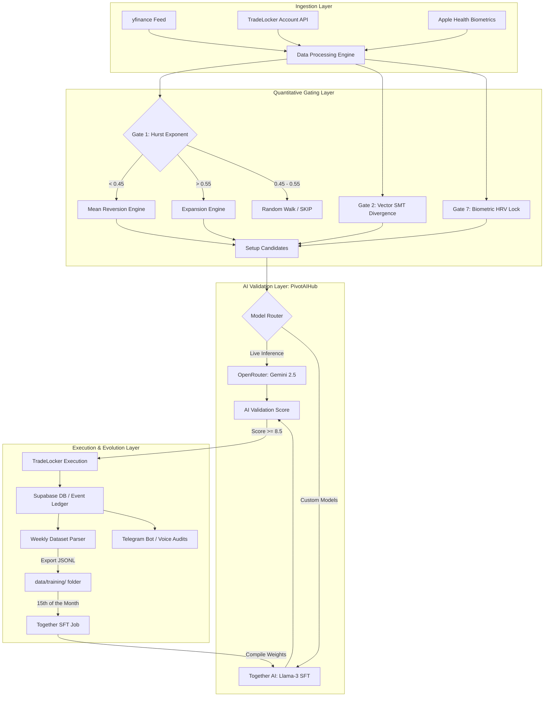
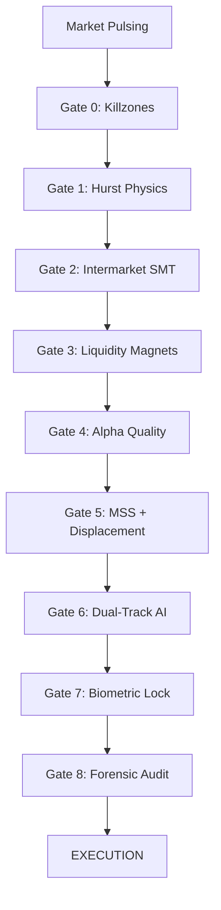

# BayesianPivot Trading Infrastructure 🧠💎

**An institutional-grade synthetic consciousness for price discovery, multi-strategy execution, and risk gating.**

BayesianPivot is a professional-grade trading Operating System that synthesizes Inner Circle Trader (ICT) concepts with high-frequency execution filters, multimodal trader sentiment analysis, and a tiered security architecture.

At its core, the system replaces speculative liability with the probabilistic certainty of the **9-Gate Bayesian Funnel**—a deterministic gauntlet orchestrating market physics (Hurst), intermarket confluence (SMT), and prop-firm forensic auditing. Recently adapted to support a broader multi-engine ecosystem, this strict funnel now operates alongside high-velocity strategies (like the Alpha Sweep, which runs on a streamlined **4-Gate subset** of these filters), all governed by our custom Serverless GPU AI infrastructure (Together AI & OpenRouter).

**"Bayesian institutional alpha. Replacing liability with probabilistic certainty: 9-Gate Funnel, Together AI SFT, OpenRouter, SMT, Hurst physics, biometrics, forensics & secure OPSEC."**

---

## 🏛️ System Pipeline & Flow Architecture
The diagram below maps the complete data ingestion, processing, validation, and execution pipeline of the BayesianPivot trading OS:


```mermaid
flowchart TD
    %% Ingestion Layer
    subgraph Ingestion [Ingestion Layer]
        A1[yfinance Feed] --> B1[Data Processing Engine]
        A2[TradeLocker Account API] --> B1
        A3[Apple Health Biometrics] --> B1
    end

    %% Quantitative Gating Layer
    subgraph QG [Quantitative Gating Layer]
        B1 --> C1{Gate 1: Hurst Exponent}
        C1 -->|< 0.45| D1[Mean Reversion Engine]
        C1 -->|> 0.55| D2[Expansion Engine]
        C1 -->|0.45 - 0.55| D3[Random Walk / SKIP]
        
        B1 --> C2[Gate 2: Vector SMT Divergence]
        B1 --> C3[Gate 7: Biometric HRV Lock]
        
        D1 & D2 & C2 & C3 --> E1[Setup Candidates]
    end

    %% AI Validation Layer
    subgraph AIV [AI Validation Layer: PivotAIHub]
        E1 --> F1{Model Router}
        F1 -->|Live Inference| G1[OpenRouter: Gemini 2.5]
        F1 -->|Custom Models| G2[Together AI: Llama-3 SFT]
        G1 & G2 --> H1[AI Validation Score]
    end

    %% Execution & Evolution Layer
    subgraph EE [Execution & Evolution Layer]
        H1 -->|Score >= 8.5| I1[TradeLocker Execution]
        I1 --> J1[Supabase DB / Event Ledger]
        
        J1 --> K1[Weekly Dataset Parser]
        K1 -->|Export JSONL| L1[data/training/ folder]
        L1 -->|15th of the Month| M1[Together SFT Job]
        M1 -->|Compile Weights| G2
        
        J1 --> N1[Telegram Bot / Voice Audits]
    end
```

---

## 🧬 Architectural Evolution
The infrastructure has undergone three major evolutionary phases to optimize latency, reduce cloud overhead, and maintain complete IP control:

### Phase 1: Cloud-Native Serverless (Modal Cloud)
*   **Infrastructure:** Commenced as an ephemeral serverless system run on Modal Cloud containers.
*   **Limitations:** Stateless runs required fetching historical market data from scratch on every tick, creating execution lag, high cold-start times, and escalating distributed computing bills for 24/7 scanning.
*   **Data Flow:** Supabase was queried on every cron cycle (every 15m), and in-memory states (like consecutive wins/losses) could not be kept.

### Phase 2: Edge Compute Migration (Local Sovereign Runner)
*   **Infrastructure:** Shifted execution to the edge (local Mac M-series hardware) running a persistent, loop-based runner (`local_scanner.py`), while keeping "Storage" in Supabase Cloud Postgres.
*   **Advantage:** Zero cold-start latency, persistent in-memory variables, and zero serverless compute fees. Localized yfinance cache (`data/yfinance_cache/`) was introduced here to prevent SQLite file locks and macOS process-forking permission errors.

### Phase 3: AI Gateway & SFT Decoupling (Together AI & OpenRouter)
*   **Infrastructure:** Migrated from a hard-locked Google Vertex AI/Gemini setup to a decoupled gateway (`PivotAIHub`). 
*   **Advantage:** Allows routing validation tasks across cheap API proxies (Gemini 2.5 Flash via OpenRouter for $0.00015 per scan) and serverless Supervised Fine-Tuning (SFT) training environments (Together AI for $0.30 per training run), preventing vendor lock-in while cutting model overhead by over 90%.

---

## 🛡️ Architecture Core: The 9-Gate Signal Funnel
The 9-Gate Funnel remains the crown jewel of the BayesianPivot infrastructure. No standard trade is executed in isolation. Every signal must survive this sequential "Gauntlet" to filter for institutional backing.


```mermaid
graph TD
    A[Market Pulsing] --> G0[Gate 0: Killzones]
    G0 --> G1[Gate 1: Hurst Physics]
    G1 --> G2[Gate 2: Intermarket SMT]
    G2 --> G3[Gate 3: Liquidity Magnets]
    G3 --> G4[Gate 4: Alpha Quality]
    G4 --> G5[Gate 5: MSS + Displacement]
    G5 --> G6[Gate 6: Dual-Track AI]
    G6 --> G7[Gate 7: Biometric Lock]
    G7 --> G8[Gate 8: Forensic Audit]
    G8 --> J[EXECUTION]
```

### Gate 0: Institutional Timing (Killzones)
Trading is restricted to high-liquidity windows where central bank algorithms are most active.
- **Asian Range**: 00:00 - 04:00 UTC (The "Anchor" for the day's expansion).
- **London Open**: 07:00 - 10:00 UTC (Search for the "Judas Swing").
- **NY Open**: 12:00 - 17:00 UTC (Final distribution or Reversal).

### Gate 1: Market Physics (Dual-Regime Hurst)
The system calculates a **200-candle rolling Hurst Exponent** to classify the market "State":
- **Efficiency (H < 0.45)**: Mean-Reverting. Activates *Reversal Mode* targeting liquidity sweeps.
- **Chaos (0.45 – 0.55)**: **SKIP**. No directional advantage detected.
- **Persistence (H > 0.55)**: Trending. Activates *Expansion Mode* targeting Fair Value Gaps.

### Gate 2: Intermarket Confluence (Vectorized SMT)
Real-time correlation audit between correlated assets (e.g., DXY/BTC/ETH).
- **SMT Divergence**: If the Dollar makes a Lower Low but the Asset fails to make a Higher High, institutional accumulation is confirmed.
- **Divergence Threshold**: Requires a >2.0 standard deviation separation to clear the gate.

### Gate 3: Liquidity Magnets (EQL/Sweep Pools)
Identification of high-conviction targets before entry.
- **EQL/EQH Mapping**: Detects "Retail Support/Resistance" as targets for institutional stop-clearing.
- **Order Flow Depth**: Scans for historical liquidity clusters where large orders are "hidden."

### Gate 4: HFT Alpha Precision (Wick Ratio Gating)
A mathematical filter for the quality of a liquidity sweep.
- **Cascade Depth**: Requires price to clear at least 2 levels of stop-liquidity before acknowledging a "Hunt."
- **Wick Quality**: Scores the rejection speed (>0.8 ATR) to ensure the move was a sweep, not a breakout.

### Gate 5: Structure Shift (MSS + Displacement)
Confirmation of intent shift on lower timeframes (1m-5m).
- **MSS**: A close beyond the most recent swing point.
- **Displacement**: Requires candles with bodies >1.5x the average volume/size to confirm a "V-shape" recovery or departure.

### Gate 6: Dual-Track AI Validation (`PivotAIHub`)
Final logic audit via the **Unified AI Hub SFT Analysis** using a bifurcated review:
- **Control Track (OpenRouter/Gemini)**: A "Reject-by-Default" persona analyzing the chart for retail inducement traps.
- **Shadow Track (Together AI)**: A custom fine-tuned Llama-3 model trained exclusively on the proprietary execution ledger to adjust risk-weighting based on historical setups.

### Gate 7: Biometric Physiological Lock
Biologically-aware execution gating via **Apple Health Integration**.
- **The Heart-Rate Gate**: If BPM > 100 or HRV < 25ms, the system detects "Trader Tilt" and restricts risk by 50-100%.
- **Physio-Gated Alpha**: Trading is only permitted when the practitioner is in a state of analytical coherence.

### Gate 8: Forensic Prop-Audit
Compliance auditing for institutional and funded account providers.
- **Loop Detection**: Scans for "Adversarial Loops" in rule documents (e.g., trailing equity drawdown).
- **Safety Margin**: Forces a hard stop if the session's projected risk exceeds firm-specific "Consistency Rule" thresholds.

---

## 🧠 The Multi-Strategy Philosophy: Why Dual Engines?
Originally, the infrastructure operated solely on the strict 9-Gate SMC Funnel. While highly profitable, this approach presented a trade-frequency bottleneck: the funnel's high rigor meant the system stood aside for days during fast-moving, high-momentum market phases.

To solve this, we migrated to a **dual-engine, multi-strategy approach**:
- **Capital Anchor (SMC Engine):** Preserves capital by waiting for rare, high-confluence institutional reversals. It trades with heavy sizing because the probability of success is mathematically maximized by the 9-Gate gauntlet.
- **Velocity Driver (Alpha Sweep Engine):** Captures high-frequency intraday momentum. By stripping away slow validation gates, it acts on immediate structural displacement, scaling down position sizing by 50% to maintain a steady equity curve and keep capital active.
- **The Synergy:** Together, they smooth the portfolio's drawdown cycles, keeping yield consistent while ensuring institutional risk standards are never violated.

---

## ⚡ The Two Active Strategy Engines

### 1. The SMC Reversal Engine (The 9-Gate Funnel)
- **Primary Objective:** Captures major market turning points (Institutional accumulation/distribution).
- **Core Signal:** Sweeps of high-timeframe (1H/Daily) fractals, requiring displacement and structural shifts on the 5m chart.
- **Validation Rigor:** Full 9-Gate execution. Requires SMT divergence (standard deviation > 2.0), DXY trend alignment, real-time AI validation via `PivotAIHub`, Apple Health biometric verification, and Prop Firm compliance audits.
- **Risk Profile:** Full risk sizing (fixed USD amount or full scaling). Target Reward-to-Risk (RR) ratio of 3:1.

### 2. The Alpha Sweep Engine (Streamlined 4-Gate Execution)
- **Primary Objective:** Captures quick, high-velocity displacement sweeps (imbalance reclaims and momentum continuations).
- **Core Signal:** Reclaims of recent swing levels with strong wick rejection during active sessions.
- **Validation Rigor:** Streamlined 4-Gate execution. Bypasses SMT, Order Book, AI validation, Biometrics, and Prop Audit. It runs only:
  - *Gate 0 (Killzones):* Execution restricted strictly to high-liquidity session windows.
  - *Gate 1 (Hurst Exponent):* Rejects random walk chop (\(0.45 \le H \le 0.55\)).
  - *Gate 4 (Wick & Depth):* Verifies \(\ge 30\%\) wick rejection and ATR-relative sweep depth.
  - *Gate 5 (Trend Alignment):* Forces direction to align with the 1H 50 EMA during trending states.
- **Risk Profile:** Automatically downsized to 50% of the base risk parameter to maintain strict risk-of-ruin guardrails.

---

## 🧠 The Bayesian Psychologist (Psychology Engine)
Trading is biological. This engine protects the system from the trader.
- **Interactive Sentiment**: The system periodically prompts via Telegram for the trader's mental state. Natural language analysis (`PivotAIHub`) determines the "Trader Sentiment" score.
- **Risk Gating**: High Tilt (Score > 6) triggers automated trade-downsizing with a **0.25x Risk Floor**—protecting equity without a hard-stop on potential alpha. Panic/Revenge indices trigger a **Hard Shutdown**.
- **Voice Verdicts**: The Gatekeeper provides auditory audits via macOS native TTS to ground the trader during high-volatility events.

---

## 🧬 The Evolution Layer (SFT & Rogue Audit)
The system functions as a **Synthetic Consciousness** that learns from both its successes and the trader's failures.

### 1. Auto-Contextualization (Zero-Input Audit)
When a discretionary/manual trade is executed ("Rogue Trade"), the system immediately triggers a **Forensic Reconstruction**. Without human input, it fetches historical 5m/1h data to determine the full **Institutional Footprint** at the moment of entry.

### 2. Delta Analysis: System vs. Rogue
The infrastructure maintains two distinct ledgers:
- **System Signals**: 9-Gate approved setups and Alpha Sweeps with high probabilistic edge.
- **Rogue Trades**: Discretionary entries that bypassed the funnel.
The **Delta Engine** compares the outcomes of these two paths, identifying "Alpha Leakage" (where the trader was right but the system was too conservative) and "Impulse Traps" (where the trader was wrong and the system correctly rejected).

### 3. Serverless SFT Retraining Loop (Together AI)
Every Sunday at 00:00 UTC, the system executes an **Automated Retraining Cycle** to evolve the model's pattern recognition:
- **Soft Training**: Automatically compiles the past week's "Ground Truth" outcomes into a local in-memory few-shot context window, injected dynamically into active validation prompts.
- **Hard Fine-Tuning (Deep SFT)**: The weekly loop automatically stages and exports structured datasets formatted specifically for serverless SFT. It produces OpenAI/Together-compatible JSONL files (with correct `user`/`assistant` role structures) stored in `data/training/`.
- **Monthly Retraining Cycle**: On the 15th of each month, the compiled dataset is used to run a Supervised Fine-Tuning (SFT) job on Together AI using `meta-llama/Meta-Llama-3-8B-Instruct` as the base. The resulting custom model is then linked back via the `.env.local` config (`TOGETHER_MODEL`) to handle active validation.
- **Alpha Hunting**: The system prioritizes human discretionary trades marked as `ALPHA` by the auditor, training the model to replicate and automate the trader's unique, high-conviction edge.

---

## 🛠️ LLM Ops & Token Optimization
To maintain cost efficiency and stay within API rate limits during high-frequency scans, the codebase implements specialized LLM Ops layers:
- **Rule Compression (`prop_guardian.py`)**: Prop firm rules can be tens of thousands of tokens. The system uses regex-based extraction to compress raw rules into under 4,000 characters (a 73% payload reduction) while preserving full validation accuracy.
- **Real-Time Token Tracking (`token_tracker.py`)**: Every API call routes through a local tracker that logs prompt/completion token usage and cost metrics to local SQLite databases, generating daily alerts to ensure inference costs remain nominal.

---

## 💾 System Stability & Concurrency Engineering
To maintain 24/7 uptime in a live trading environment:
- **Localized Database Caching (`data/yfinance_cache/`)**: Direct local yfinance caching prevents macOS process-forking issues and SQLite write-lock errors that arise from multiple concurrent background scan workers.
- **Vitals Preloading**: System startup logic is reordered to import core config parameters and resolve dependency caching before establishing server connections, neutralizing race conditions on startup.

---

## 📈 Quantitative & Mathematical Foundations
To bridge high-level trading concepts with statistical rigor, the system implements verified mathematical models at each gate:

### 1. Regime Classification (Hurst Exponent & ADF)
To classify the local market structure as **Mean-Reverting** (Range) or **Persistent** (Trending), we calculate a rolling Hurst Exponent (\(H\)) via lag-variance scaling:
\[\tau(\Delta t) = \sqrt{\text{Var}(x_t - x_{t-\Delta t})} \propto \Delta t^{H}\]
We perform a log-log linear regression of \(\tau\) against a range of lags (\(\Delta t \in [2, 20]\)). The slope of this regression line corresponds to \(H/2\), yielding:
\[H = \text{slope} \times 2.0\]
- **Mean-Reverting (\(H < 0.45\))**: Validates range reclaims and fades (e.g., Turtle Soup). Confirmed using the **Augmented Dickey-Fuller (ADF) Test** for stationarity (\(p < 0.05\)).
- **Persistent (\(H > 0.55\))**: Validates breakout expansion and momentum sweeps.

### 2. Intermarket SMT Divergence (Z-Score Spreads)
We quantify the divergence between correlated assets (e.g., DXY, BTC, ETH) by calculating the \(z\)-score of their normalized rolling spread. Let \(S_t\) be the normalized price spread between Asset A and Asset B:
\[z = \frac{S_t - \mu_S}{\sigma_S}\]
where \(\mu_S\) and \(\sigma_S\) are the rolling 20-period mean and standard deviation of the spread. An SMT divergence is cleared only when the deviation exceeds a strict threshold:
\[|z| > 2.0\]
This ensures that execution is backed by a statistically significant institutional divergence, rather than random market noise.

### 3. Biometric & Psychological Gating (HRV Risk Scaling)
Risk is dynamically scaled down as a function of the trader's physiological tilt and natural language sentiment. The risk multiplier \(M_{\text{risk}}\) is calculated as:
\[M_{\text{risk}} = M_{\text{tilt}} \times M_{\text{sentiment}}\]
- **Physiological Multiplier (\(M_{\text{tilt}}\))**: Derived from Heart Rate Variability (HRV) and Heart Rate (HR):
  \[M_{\text{tilt}} = \begin{cases} 
      1.0 & \text{if } \text{HR} \le 100 \text{ and } \text{HRV} \ge 25\text{ms} \\
      0.5 & \text{if } \text{HR} > 100 \text{ or } \text{HRV} < 25\text{ms} \\
      0.0 & \text{if } \text{HR} > 120 \text{ (Hard Lock)}
   \end{cases}\]
- **Sentiment Multiplier (\(M_{\text{sentiment}}\))**: Evaluated via custom LLM classification of the trader's Natural Language input:
  \[M_{\text{sentiment}} = \max\left(0.25, 1.0 - 0.15 \times \text{Tilt Score}\right)\]
  where \(\text{Tilt Score} \in [0, 10]\).

---

## 📂 Repository Layout
```directory
├── .agents/               # LLM system behavior & repository segregation rules
├── analysis/              # Account auditing & performance reporting scripts
├── backtesting/           # Monte Carlo simulators & historical backtest engines
├── docs/                  # In-depth design guides & cost metrics (e.g., MODEL_OVERHEAD.md)
├── scripts/               # Utility, maintenance, and automated sync scripts
├── src/
│   ├── clients/           # TradeLocker API client & Telegram notifier
│   ├── core/              # Config loader, database interfaces, & system vitals
│   ├── engines/           # 9-Gate filters, Alpha Sweep scanner, & AI Hub orchestrator
│   └── runners/           # Main local execution runners & loop watchdogs
├── strategies/            # Strategy blueprints and mathematical parameters
└── tests/                 # Unit tests & pipeline validation suites
```

---

## ⚙️ Getting Started & Configuration

### 1. Installation
Clone the repository and install the required dependencies:
```bash
pip install -r requirements.txt
```

### 2. Environment Setup
Create a `.env.local` file in the root directory based on the `.env.example` template:
```env
# AI Hub Credentials
OPENROUTER_API_KEY=your_openrouter_api_key_here
TOGETHER_API_KEY=your_together_api_key_here

# Active Models
OPENROUTER_MODEL=google/gemini-2.5-flash
TOGETHER_MODEL=meta-llama/Meta-Llama-3-8B-Instruct

# Execution Keys
TELEGRAM_BOT_TOKEN=your_telegram_token_here
TELEGRAM_CHAT_ID=your_chat_id_here
TRADELOCKER_ACCOUNT_ID=your_tradelocker_account_id_here
```

### 3. Running the Infrastructure
To spin up the local execution runner and initiate the scan cycle:
```bash
bash scripts/start_runner.sh
```

To run the automated verification test suite to ensure the AI validation and market feeds are fully operational:
```bash
python -m unittest discover tests/
```
