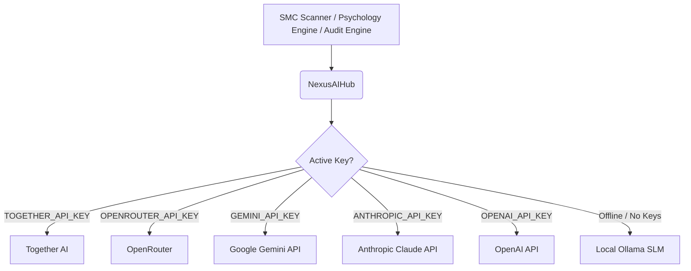

# Bayesian Pivot: AI Model Infrastructure & Overhead Guide

This document outlines the unified AI orchestration layer, the dual-track learning loop (Soft/Hard SFT), active providers, configuration, and monthly operational costs.

---

## 1. Core Architecture: `NexusAIHub`

All AI-powered tasks (Trade Validation, Psychology Audits, Trade Auditing, and Vision Bias Detection) route through a centralized model wrapper: `NexusAIHub` ([ai_hub.py](file:///Users/nicholasmacaskill/sovereignSMC/bayesian-pivot-trading-infra/src/engines/ai_hub.py)). 

The hub prioritizes direct APIs, manages model failovers, and supports direct or proxy endpoints:


---

## 2. Daily Live Trading (Inference)

Live validation is managed by OpenRouter to route requests to highly optimized base models with failover resilience.

* **Primary Provider**: **OpenRouter**
* **Active Model**: `google/gemini-2.5-flash` (or `meta-llama/Llama-3.3-70B-Instruct-Turbo` via Together)
* **Configuration**: Set in `.env.local`
  ```env
  OPENROUTER_API_KEY=your_openrouter_api_key_here
  OPENROUTER_MODEL=google/gemini-2.5-flash
  ```

### Live Validation Costs
* **Gemini 2.5 Flash Cost**: $0.075 / 1M input tokens.
* **Tokens per scan**: ~2,000 tokens.
* **Inference Cost**: **$0.00015 per scan**.
* **Monthly Budget**: A $3.00 pre-funded credit on OpenRouter easily covers **months of continuous 24/7 scans** (funding up to 20,000 runs).

---

## 3. The Dual-Track Retraining Loop

To maintain and compound the trading edge, the bot self-corrects using outcomes recorded in the local database.

### A. Weekly "Soft" Retraining (Automatic few-shot injection)
* **Frequency**: Automatically runs every Sunday at 00:00 UTC.
* **Mechanism**: Reads outcomes from the database, builds a local cache of the best wins/losses, and saves them to `few_shot_examples.json`.
* **Execution**: Injects these examples into the validation prompts automatically during live scans.
* **Cost**: **$0.00** (Runs completely locally).

### B. Monthly "Hard" Retraining (SFT Fine-Tuning)
* **Frequency**: Triggered monthly (scheduled for the 15th).
* **Provider**: **Together AI** (direct integration).
* **Base Model**: `meta-llama/Meta-Llama-3-8B-Instruct` (or 3.1 equivalent).
* **Dataset Export**: The bot's weekly retraining loop automatically exports Together-ready files to your directory:
  * Location: [data/training/](file:///Users/nicholasmacaskill/sovereignSMC/bayesian-pivot-trading-infra/data/training/)
  * File suffix: `training_[timestamp]_together.jsonl` (using `role: "assistant"` format).

### SFT Training Costs
* **Together AI Training Rate**: $1.50 / 1M training tokens.
* **Dataset Size**: ~200k tokens (for 99 trade examples).
* **Training Cost**: **$0.30 per training run** (30 cents!).
* **Inference Rate (Custom Model)**: $0.20 / 1M tokens (**$0.0004 per scan**).
* **Monthly Budget**: A $5.00 pre-funded credit on Together AI covers multiple training runs and inference tests.

---

## 4. How to run SFT on Together AI (Step-by-Step)

On the **15th of each month** (when your calendar reminder triggers in chat):

1. Log into your **[Together.ai](https://www.together.ai)** account.
2. Go to the **Fine-Tuning** tab on the left sidebar.
3. Click **Upload Dataset** and select the latest auto-compiled Together-ready file from your computer:
   * Path: `/Users/nicholasmacaskill/sovereignSMC/bayesian-pivot-trading-infra/data/training/training_[latest_timestamp]_together.jsonl`
4. Click **Create Fine-Tuning Job**.
5. Select `meta-llama/Meta-Llama-3-8B-Instruct` (or the recommended Llama-3-8B base model) and start training.
6. Once training completes, Together AI will host the model on their cloud and output a model ID (e.g., `your-username/meta-llama-3-8b-instruct-ft-2026-07-05`).

### Connecting your Custom Model
Open your [.env.local](file:///Users/nicholasmacaskill/sovereignSMC/bayesian-pivot-trading-infra/.env.local) file and insert your Together credentials:
```env
TOGETHER_API_KEY=tgp_v1_gAf4m3bcVCXLzmC75LR5PAFSr_OwIGUS1SoEhTeK-n0
TOGETHER_MODEL=your-username/meta-llama-3-8b-instruct-ft-2026-07-05
```
Save the file and restart the runner. The bot will instantly route all validation decisions through your custom fine-tuned model!

---

## 5. Local Caching & Performance Tuning

To optimize runtime safety and bypass operational errors:
* **YFinance Caching**: Localized to `data/yfinance_cache/` inside the workspace to avoid macOS permission locks and SQLite concurrency write errors.
* **Weekend Checks**: Traditional finance feeds (DXY, NQ, TNX) freeze at 0.00% on weekends. Vitals check is reordered to import `Config` first to ensure yfinance dummy caching is initialized before connections are probed.
