# The Sovereign Execution Plan: Roadmap to Professional Autonomy

**Owner:** Nicholas Macaskill  
**Effective Dates:** June 10, 2026 – August 12, 2026 (Phase 1) | August 12, 2026+ (Phase 2)  
**Objective:** Maintain a strict $100/$200 risk structure on the verified Bayesian Pivot BTC-only system to secure a $1,200 payout before departing for Vancouver on August 12, while transitioning the infrastructure to fully automated cloud execution.

---

## 📊 1. The Audited Foundation (Proof of Edge)

The local SQLite database and Supabase audit logs confirm that your system possesses a highly profitable trading edge. Your account is only flat because discretionary manual overtrading wiped out the bot's gains.

### All-Time Performance Comparison (March 10 – June 10)

| Metric | SYSTEM (Automated) | ROGUE (Manual Discretionary) |
| :--- | :---: | :---: |
| **Total Net PnL** | **+$4,296.01** | **-$4,263.53** |
| **Total Trades** | 127 | 236 |
| **Win Rate** | **48.03%** | 35.59% |
| **Wins / Losses** | 61 W / 66 L | 84 W / 152 L |
| **Average Win** | **+$261.54** | +$227.19 |
| **Average Loss** | -$176.63 | **-$153.60** |
| **Realized Risk-Reward (R:R)** | **1.48** | 1.48 |
| **Profit Factor** | **1.37** | 0.82 |

---

## 📈 2. Period Breakdown: The Game-Changing Shift
Dividing the 3-month history into two distinct phases—**Month 1 (March 10 – April 10)** vs. **Months 2 & 3 (April 10 – June 10)**—shows the impact of your trading behavior:

### Period 1: The Overtrading Disaster (March 10 – April 10)
*   **SYSTEM**: 110 trades | **+$3,228.76 PnL**
*   **ROGUE**: 196 trades | **-$5,355.19 PnL**
*   *Behavioral Analysis*: In the first 30 days, you averaged **6.5 manual trades per day**. This high frequency led to poor execution, emotional chasing, and completely erased the bot's $3,200 gain.

### Period 2: The Discipline Phase (April 10 – June 10)
*   **SYSTEM**: 17 trades | **+$1,067.25 PnL**
*   **ROGUE**: 40 trades | **+$1,091.66 PnL**
*   *Behavioral Analysis*: Over the last 60 days, you cut your manual trade frequency by **90%**, averaging just **0.6 trades per day**. By filtering your setups and being highly selective, you immediately converted your manual performance from a massive loss to a **+$1,091.66** profit.

---

## ⏰ 3. Session & Hourly Performance Analysis

### Performance by Session (All-Time)

| Session (UTC) | SYSTEM (Automated) PnL | Win Rate | ROGUE (Manual) PnL | Manual Win Rate |
| :--- | :---: | :---: | :---: | :---: |
| **New York (12:00 - 20:00)** | **+$3,173.60** | **55.3%** | -$1,659.17 | 37.9% |
| **London (08:00 - 12:00)** | **+$493.15** | 45.5% | -$932.68 | 38.6% |
| **Asian (00:00 - 08:00)** | **+$293.84** | 46.8% | **+$117.78** | 36.8% |
| **Off-Hours (20:00 - 24:00)** | **+$335.42** | 40.0% | **-$1,789.46** | 20.7% |

*   **SYSTEM Takeaway**: Nearly **74% of the bot's total net profit** was made during the New York Session. The high-volume trend expansions during NY morning hours are perfect for the sweep-and-expand algorithm.
*   **ROGUE Takeaway**: You lost **-$1,789.46** trading manually during "Off-Hours" (Sydney open / late NY session). Trading during dead hours with zero institutional volume is a death sentence for manual trading.

### SYSTEM Peak Hours (UTC)

#### ☀️ The Golden Hours (Best Performance)
1.  **12:00 UTC (8:00 AM EST)**: **+$2,195.55** net profit (10 trades). This is the NY pre-market / Judas Window.
2.  **14:00 UTC (10:00 AM EST)**: **+$1,955.20** net profit (6 trades). This is the NY morning session momentum.
3.  **02:00 UTC (10:00 PM EST)**: **+$1,379.01** net profit (7 trades). Tokyo Open / Asian liquidity sweeps.

#### 🛑 The Danger Zones (Worst Performance)
1.  **00:00 UTC (8:00 PM EST)**: **-$1,879.81** net loss. The daily candle transition/Sydney open is extremely illiquid and filled with spread manipulation.
2.  **09:00 UTC (5:00 AM EST)**: **-$723.09** net loss. Mid-London session consolidation.
3.  **13:00 UTC (9:00 AM EST)**: **-$611.82** net loss. NY equity open volatility spikes.

---

## ⏰ 4. Phase 1: Current AST Schedule (June 10 – August 12)
Your current location operates on **Atlantic Standard/Daylight Time (AST, UTC-3)**. 

### Core Trading & Sports Windows (AST)
*   **BTC Golden Hours**: **09:00 AM – 01:00 PM AST** (Covers the 12:00–16:00 UTC New York pre-market and morning session).
*   **MLB Game Starts**: **02:00 PM AST** (Day games) | **08:00 PM AST** (Night games).
*   **KBO Game Starts**: **06:30 AM AST** (Weekdays) | **02:00 AM / 05:00 AM AST** (Weekends).

### Day-in-the-Life Schedule (AST)

```mermaid
gantt
    title Typical AST Daily Flow
    dateFormat  HH:mm
    axisFormat %H:%M
    section Rest & Sleep
    Sleep                 :active, 22:30, 06:00
    section Trading & Betting
    KBO Live / Coffee     : 06:00, 07:30
    BTC Morning Session   : 09:00, 13:00
    MLB Model Run / Bets  : 13:00, 14:00
    KBO Evening Setup     : 20:00, 21:00
    section Deep Work
    Deep Work Coding      : 14:30, 18:30
```



*   **06:00 AM**: Wake up. Review KBO overnight results. Live-bet KBO game conclusions (weekday games start at 6:30 AM AST).
*   **07:30 AM – 09:00 AM**: Offline. Breakfast, gym, offline time.
*   **09:00 AM – 01:00 PM**: **BTC Prime Trading Session**. Keep Telegram notifications active on your Mac. Execute accepted limit orders only. **Zero manual entries.**
*   **01:00 PM – 02:00 PM**: **Bet Bodhi MLB Research**. Run MLB models, analyze lines, and lock in MLB day-game bets.
*   **02:00 PM – 06:00 PM**: **Deep Work Coding Session**. Focus on Bet Bodhi development, Sovereign AI Hub hardening, and infrastructure.
*   **06:00 PM – 08:00 PM**: Dinner & offline time.
*   **08:00 PM – 09:00 PM**: **KBO/Tokyo Night Setup**. Review lines for the next day's KBO games. Place pre-match bets. Quick check for Tokyo Open BTC signals.
*   **09:00 PM – 10:30 PM**: Wind down. No screens.
*   **10:30 PM**: Sleep.

---

## 🏔️ 5. Phase 2: Vancouver PDT Schedule (August 12 Onward)
Vancouver operates on **Pacific Daylight Time (PDT, UTC-7)**. Waking up early is essential to align with New York volume.

### Core Trading & Sports Windows (PDT)
*   **BTC Golden Hours**: **05:00 AM – 09:00 AM PDT** (Covers the 12:00–16:00 UTC New York pre-market and morning session).
*   **MLB Game Starts**: **10:00 AM PDT** (Day games) | **04:00 PM / 07:00 PM PDT** (Night games).
*   **KBO Game Starts**: **02:30 AM PDT** (Weekdays). Games finish around 05:30 AM PDT.

### Day-in-the-Life Schedule (PDT)

```mermaid
gantt
    title Typical Vancouver PDT Daily Flow
    dateFormat  HH:mm
    axisFormat %H:%M
    section Rest & Sleep
    Sleep                 :active, 21:30, 04:30
    section Trading & Betting
    KBO Late-Game Live    : 04:30, 05:15
    BTC Morning Session   : 05:00, 09:00
    MLB Research & Bets   : 09:00, 11:00
    KBO Pre-Match Setup   : 19:00, 20:00
    section Deep Work
    Deep Work Coding      : 11:00, 15:00
```



*   **04:30 AM**: Wake up. Make coffee.
*   **04:30 AM – 05:15 AM**: **KBO Live Betting Sweet Spot**. Weekday KBO games are in the 7th–9th innings. Live-bet late-game bullpen and closing situations.
*   **05:00 AM – 09:00 AM**: **BTC Prime Trading Session**. Monitor the Mac for New York pre-market and open alerts.
*   **09:00 AM – 11:00 AM**: **Bet Bodhi MLB Research**. Lock in MLB day-game bets.
*   **11:00 AM – 03:00 PM**: **Deep Work Coding Session**. High-impact development blocks while Vancouver is quiet.
*   **03:00 PM – 07:00 PM**: Outdoors, gym, relax, watch afternoon MLB games.
*   **07:00 PM – 08:00 PM**: **KBO Night Setup**. Check Tokyo Open BTC signals. Place KBO pre-match bets before they run overnight.
*   **08:00 PM – 09:30 PM**: Wind down. Offline.
*   **09:30 PM**: Sleep.

---

## 🛠️ 6. The Path to Auto-Execution (August 12)
To successfully transition to a passive, fully automated income stream by August 12, we must execute the following technical plan:

```
[Now: June 10] ──> [June - July: Trust Phase] ──> [August 1-10: Test Mode] ──> [August 12: Auto-Execute Live]
```

### 1. The Trust Phase (June 10 – July 31)
*   You execute all BTC-only Telegram alerts manually.
*   Risk is strictly limited:
    *   **Small Account**: $100 fixed risk per trade (protects the $800 remaining drawdown).
    *   **Larger Account**: $200–$250 fixed risk per trade (safely drives the $1,200 profit target).
*   The system logs every trade. The AI Validator continues to audit and grade adherence.

### 2. Auto-Execution Activation (August 1 – August 10)
If the system maintains its historical profit factor (>1.3) during the Trust Phase, we will activate automated execution on your funded accounts.
*   **Action**: Uncomment the `TradeLockerClient` order routing block in `deployment/modal_app.py`:
    ```python
    # Enable live TradeLocker orders
    from src.clients.tl_client import TradeLockerClient
    tl = TradeLockerClient()
    tl.place_order(
        instrument_id=scan['instrument_id'], 
        side=scan['side'], 
        qty=scan['qty'], 
        stop_loss=scan['stop_loss'], 
        take_profit=scan['target']
    )
    ```
*   **Result**: The bot will autonomously execute trades, calculate position sizes, place stops, and manage exits on your TradeLocker accounts. You will no longer need to wake up at 5:00 AM PDT to place orders; the system will trade passively while you sleep.

---

## 🛡️ 7. Strategy Safeguards & Failure Mitigations

> [!WARNING]
> **No Manual Exits**: Manually closing trades early or letting them run past the take-profit target breaks the mathematical edge. Let the trade hit the stop loss or the take-profit target natively.

*   **Regime Protection**: The AI Validator will automatically drop trade scores to `0.0` (Monitor Only) during low-volatility ranges or high-impact news events. Trust the silence.
*   **Limit Orders Only**: Never market-chase a trade. If you miss the entry price on an alert by more than $50, the trade is dead. A missed trade is a $0 outcome; a chased trade is a negative-expectancy outcome.
*   **Contract Size Auditing**: Always double-check that the calculated lot sizes printed in the Telegram alerts align with your broker's contract size definition before executing.
